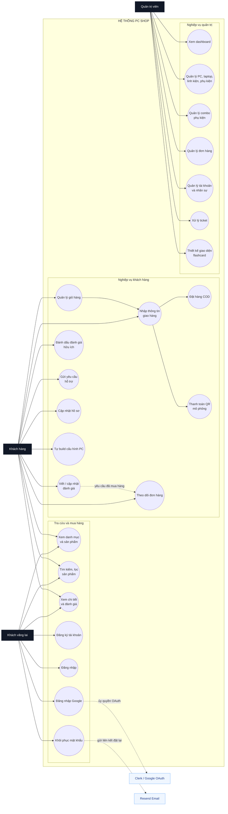
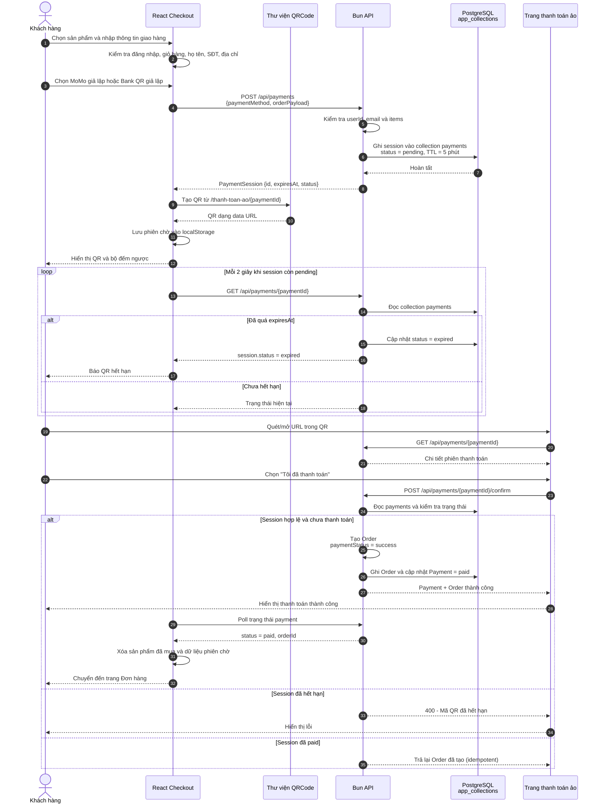
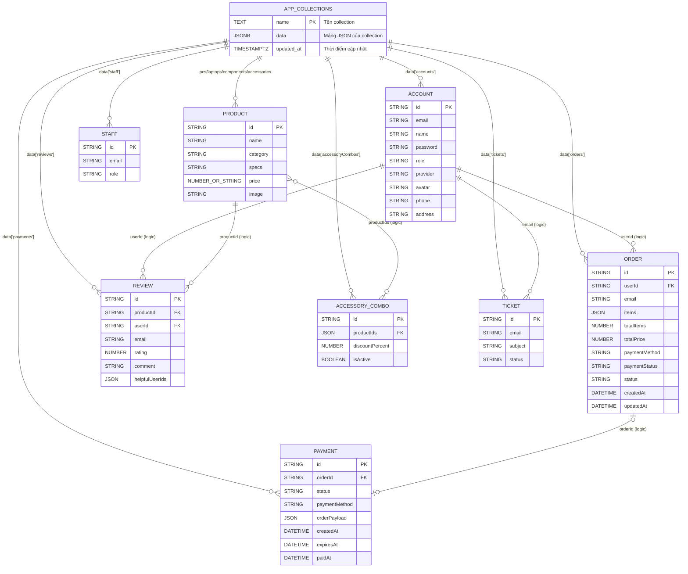
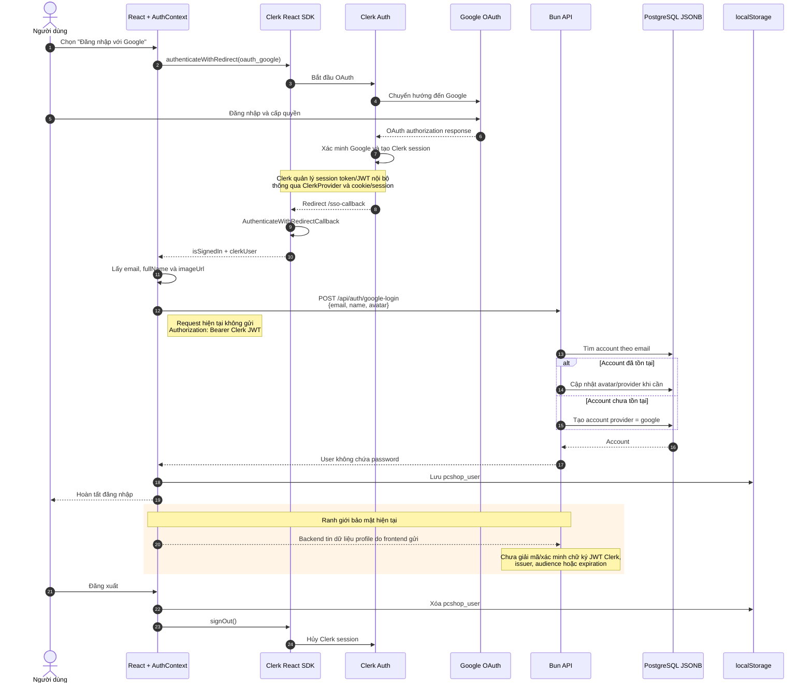

# Sơ đồ hệ thống PC Shop

Các sơ đồ dưới đây được dựng từ mã nguồn hiện tại của project:

- Frontend React trong `src/`
- Bun API trong `backend/index.ts`
- PostgreSQL adapter trong `backend/index.ts` và `backend/sync-json-to-postgres.ts`

Mỗi sơ đồ dùng Mermaid để có thể xem trực tiếp trên GitHub, VS Code hoặc xuất SVG/PNG bằng Mermaid Live Editor.

## Hình 2.1: Sơ đồ ca sử dụng hệ thống PC Shop

## Hình 2.2: Biểu đồ tuần tự luồng thanh toán QR

> Đây là thanh toán giả lập. QR chứa URL nội bộ của PC Shop và nút xác nhận tạo giao dịch, không kết nối trực tiếp với cổng MoMo hoặc ngân hàng.

## Hình 3.1: Sơ đồ dữ liệu JSONB trên PostgreSQL

Schema vật lý hiện tại chỉ có một bảng `app_collections`. Mỗi dòng là một collection và toàn bộ danh sách bản ghi được chứa trong cột `data JSONB`.

Các collection được nạp bởi backend:

`pcs`, `components`, `laptops`, `accessories`, `accessoryCombos`, `tickets`, `accounts`, `orders`, `payments`, `reviews`, `staff`, `flashcardDesigns`, `flashcardAppliedDesigns`.

Các đường nối ghi “logic” không phải foreign key vật lý. Code tìm và nối dữ liệu bằng các trường nằm bên trong JSONB.

## Hình 4.1: Luồng xác thực Google qua Clerk và trạng thái JWT

Tên chính xác cho sơ đồ theo code hiện tại nên là **“Luồng xác thực Google qua Clerk Auth và đồng bộ tài khoản”**. Nếu báo cáo bắt buộc dùng cụm “mã hóa JWT”, cần lưu ý JWT là **ký/xác minh** chứ không mặc định là mã hóa; đồng thời backend của project chưa có bước xác minh Clerk JWT.

